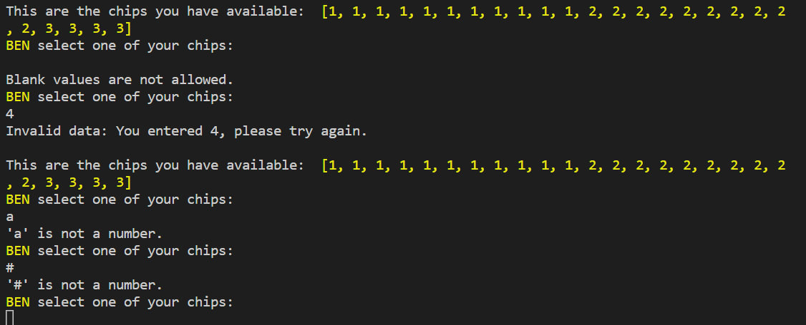

# Sum 7

Sum 7, is a Python terminal game that runs on Heroku.

This game is inspired by a board game my kids have at home, in spanish called Suma7.This is a 2 player game that has a board similar to the connect4 game, with the difference that instead of 2 players with different color chips, the players on Sum7, have numbered chips and need to sum 7 to win. 

## **How to play**

- Players must add the same colored numbers in a row or column to win. 
- Players share one board, and the game behaves as if there is gravity on the board. 
- Players must select a Numbers from 1 to 3. Each player will have 26 chips composed of : 11(eleven) ones,  11(eleven) tows and 4 (four) threes.
- Players also need to select a column to place the selected chip, columns go from A to G. 
Players take turns to place their chips on the board.
- The game ends when a player sums 7 of the same color in a row or column.

## **Features**

### **Existing Features**

#### **Title Section and rules:**

- The title of the game is displayed using the Pyfiglet library. 
- The the rules of the game appear below the title for the user to become familiar on how to start playing the game.

- Then the blank game board is displayed.

#### **Players**

- A message asking the first player to enter its name is seen first. This field cannot be left blank, if the user press enter to continue without input, a message showing that blank values are not allowed appears and the user is asked to enter the name again. 

- The game will accept any characters or numbers as a player name.
- Following the player input, a welcome message will appear with the player name in capital letters and colored. 
- Player 1 will be yellow.
- Player 2 will be green. 
- After player one is welcome, the message asking the second player to enter its name, follows. 

#### **Start of game**

- The game starts and player 1 shown the chips available for its game.
- Then, the player is asked to select a chip, the input must be a number form 1 to 3.
- After the number has been selected, the player is asked to select a letter form A to G, these are the columns where the number chip will be located. 

- The board the is printed showing the colored chip (yellow or green) located on seleted space. 

- After player 1, is player's 2 turn, to select chip and column. 
- This will continue until a winner is found.

#### **Input validation and error checking**

- Players cannot enter numbers over 3, or error message will be displayed.
- Players cannot enter letters instead of the allowed numbers.
- Players cannot leave the number input blank.

- Players cannot enter number chips that are not available anymorem because they were used.

- Players have to enter letters from A to G, if different letter from the options is entered error message is displayed.
- Players cannot leave the letter input blank.
- Players cannot enter numbers instead of letters.
- Players cannot enter symbols instead of letters.

- Players cannot place a chip if a column is full. 

#### **End of Game**

- Once a player is found to have sum 7, the game ends and the winner is congratulated. 
- The winner is then ask if they will like to play the game again. 
- If YES, the screens clears, board and chips are reset and the game starts again, players are asked to enter their names.
- If they answer NO, the game ends. Player is thanked for playing.

## **Future Features**

- Sum the chips on the diagonal line left and right.
- To make this game harder the number 3 chip will be able to be placed only in determined row/columns, as the actual game.

## **Testing**

- On starting the game, player 2 would start with the chips, instead of player one. This was resolved by changing the value of the turn in the player dictionary from False to True.

- Another challenge was to sum the values vertically as the coordinates of the chips were on reversed, after loads of testing I had to look for a way to reversed the array : https://www.askpython.com/python/array/reverse-an-array-in-python

- On testing the game, I discovered that the game would not let you put chips on the last row. This was corrected by changing the range to -1.

- Once resolved, players were able to fill the last row with the chip, but if trying to put another chip in the last row that was occupied, they would lose the chip, but there was no warning to choose another row and try again. First, I had to address the warning of full column.

- Then, I proceed to keep the intended play chip available. This was done by calling the remove-chip-function once the available space was checked.

## **Bugs**

No remaining bugs.

## **Validator Testing**
No error were returned from PEP8 Python Validator
https://pep8ci.herokuapp.com/

## **Deployment**

- The site was deployed via Heroku, and the live link can be found here: https://sum-7.herokuapp.com/
- The project was developed  with the Code Institute Template.
- Steps for deployment where as follow:
1. Log in to Heroku.
2. Click the Create App button.
3. From the Settings Tabs scroll down to  Buildpack section, and select: first Python and save, then select NodeJS and save.
4. Then create a CONFIG-VAR called PORT and set it to 8000. 
5. On the Deploy tab, select Github as the deployment method.
6. Search for the repository name and connect.
7. Click Deploy:
- I Enable Automatic Deploys for automatic deployment.
- Then click Deploy Branch.

## **Credits**

- The code for the board section and coordinate was taken from https://www.youtube.com/watch?v=NkmYfTl2L_Y 
- The code for the iterable checking the same ownership of the chips was take from https://stackoverflow.com/questions/58837144/most-pythonic-way-to-check-list-boils-down-to-one-value
- I would like to thanks my Mentor, Andre Aquilina who helped me and worked with me on the function to sum the chip values on the horizontal board.

**Other resources:**
- W3Schools - Python
- Stack Overflow
- https://www.geeksforgeeks.org/python-using-2d-arrays-lists-the-right-way/
- https://www.askpython.com/python/two-dimensional-array-in-python

## **Libraries & Technology Used**

### **Built-in Python Libraries**

- [Pyfiglet](https://pypi.org/project/pyfiglet/0.7/) for the name of the game and enf of play.
- [Colorama](https://www.geeksforgeeks.org/print-colors-python-terminal/) for giving different color to the players and their chips.
- [Pyinputplus](https://pypi.org/project/PyInputPlus/) was used to handel validation on the players input. This library was sugested by my tutor.
- Iterools was imported to iterate over the player chip to be able to isolate the need one to sum 7.
- Os was imported to clear the board at the end of the game.

